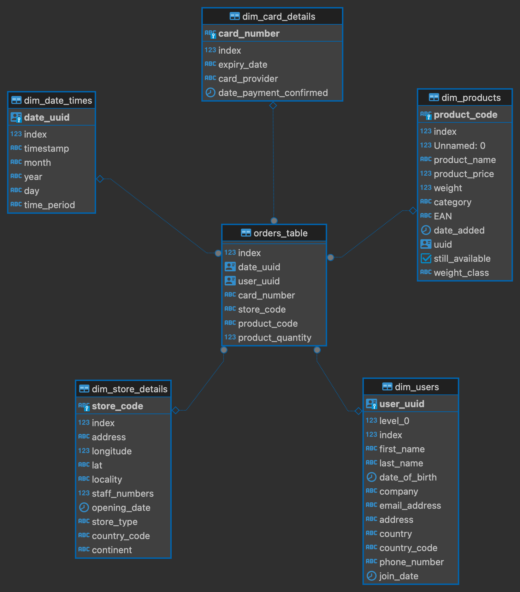

# multinational-retail-data-centralisation271
Development of a star base schema for the data of a multinational company starting from the extraction of data from different sources, cleaning the data, and then uploading to a local database for querying.



## Table of Contents
- Installation
- Usage
- File Structure
- License Information

## Installation
```bash
clone https://github.com/bc319IC/multinational-retail-data-centralisation271.git` ``` 
for local access.


## Usage
Run the appropraite files in the following section regarding their descriptions.

## File Structure

### retail.ipynb
Run all in retail.ipynb for the data extraction of each table using different methods due to different sources, followed by the cleaning of the data, and uploading to the local postgres database.

#### database_utils.py
Contains the class for connecting to the local postgres database.

#### data_extraction.py
Contains the class for the different types of data extraction methods.

#### data_cleaning.py
Contains the class for cleaning all the dataframes in this project.

### SQL files

#### set_primary_keys.sql, set_foreign_keys.sql, m4 folder
These files and the files in the folder are quite self explanatory by name.


## License Information
This project is licensed under the terms of the MIT license. (tbd)